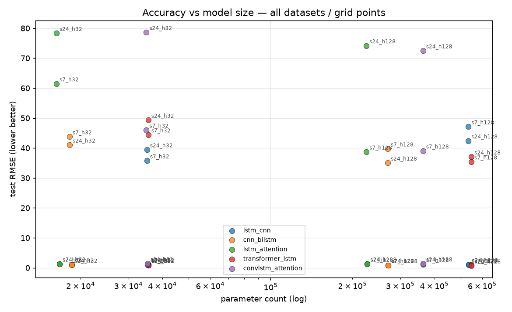
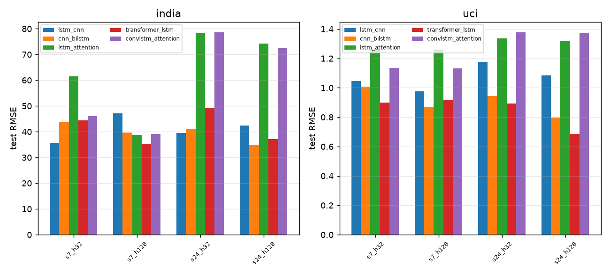

# Hybrid Model Benchmark — accuracy vs parameters

## What was measured

Every model trains on the identical 80:20 temporal split (SMOTE on train only, fixed seed 42) of the same windows/scalers, varying only the two architectural hyper-parameters under test: the input look-back `seq_len` (7 vs 24 hours) and the hidden capacity `hidden_size` (32 vs 128 units). Epochs, LR, dropout, layers, scheduler, early stopping and auto overfit/underfit correction are identical across runs. Reported: regression RMSE/MAE/R2, bucket accuracy/F1, parameter count, CPU training wall-clock, inference ms/batch.

## Dataset: india

### 1. Per-model, per-grid-point results

**lstm_cnn**

| gridpt | RMSE | MAE | R2 | acc | F1 | params | train | infer | detect | epochs |
|---|---|---|---|---|---|---|---|---|---|---|
| s24_h128 | 42.410 | 32.816 | 0.873 | 0.521 | 0.490 | 533,511 | 10s | 12.53ms | none | 5 |
| s24_h32 | 39.446 | 28.319 | 0.890 | 0.465 | 0.412 | 35,079 | 2s | 2.76ms | none | 5 |
| s7_h128 | 47.105 | 34.591 | 0.839 | 0.576 | 0.560 | 533,511 | 5s | 4.54ms | none | 5 |
| s7_h32 | 35.751 | 26.173 | 0.907 | 0.559 | 0.541 | 35,079 | 2s | 2.25ms | none | 5 |

**cnn_bilstm**

| gridpt | RMSE | MAE | R2 | acc | F1 | params | train | infer | detect | epochs |
|---|---|---|---|---|---|---|---|---|---|---|
| s24_h128 | 35.019 | 25.762 | 0.914 | 0.620 | 0.616 | 269,447 | 7s | 10.61ms | none | 5 |
| s24_h32 | 41.021 | 29.283 | 0.881 | 0.530 | 0.512 | 18,215 | 2s | 2.88ms | none | 5 |
| s7_h128 | 39.748 | 29.344 | 0.885 | 0.651 | 0.645 | 269,447 | 4s | 3.12ms | none | 5 |
| s7_h32 | 43.764 | 31.467 | 0.861 | 0.614 | 0.608 | 18,215 | 3s | 2.12ms | none | 5 |

**lstm_attention**

| gridpt | RMSE | MAE | R2 | acc | F1 | params | train | infer | detect | epochs |
|---|---|---|---|---|---|---|---|---|---|---|
| s24_h128 | 74.178 | 54.023 | 0.613 | 0.360 | 0.304 | 224,807 | 6s | 7.81ms | none | 5 |
| s24_h32 | 78.318 | 56.684 | 0.568 | 0.343 | 0.250 | 16,295 | 2s | 1.85ms | none | 5 |
| s7_h128 | 38.694 | 27.772 | 0.891 | 0.651 | 0.651 | 224,807 | 3s | 2.19ms | none | 5 |
| s7_h32 | 61.469 | 44.164 | 0.726 | 0.403 | 0.338 | 16,295 | 1s | 0.78ms | none | 5 |

**transformer_lstm**

| gridpt | RMSE | MAE | R2 | acc | F1 | params | train | infer | detect | epochs |
|---|---|---|---|---|---|---|---|---|---|---|
| s24_h128 | 37.067 | 27.846 | 0.903 | 0.643 | 0.642 | 547,335 | 24s | 16.58ms | none | 5 |
| s24_h32 | 49.323 | 38.145 | 0.829 | 0.456 | 0.408 | 35,463 | 7s | 4.02ms | none | 5 |
| s7_h128 | 35.393 | 25.971 | 0.909 | 0.627 | 0.622 | 547,335 | 8s | 6.78ms | none | 5 |
| s7_h32 | 44.427 | 33.633 | 0.857 | 0.478 | 0.440 | 35,463 | 3s | 1.43ms | none | 5 |

**convlstm_attention**

| gridpt | RMSE | MAE | R2 | acc | F1 | params | train | infer | detect | epochs |
|---|---|---|---|---|---|---|---|---|---|---|
| s24_h128 | 72.487 | 54.213 | 0.630 | 0.371 | 0.291 | 363,399 | 9s | 9.86ms | none | 5 |
| s24_h32 | 78.636 | 58.619 | 0.565 | 0.340 | 0.264 | 34,887 | 4s | 3.83ms | none | 5 |
| s7_h128 | 39.045 | 28.709 | 0.889 | 0.624 | 0.620 | 363,399 | 4s | 4.40ms | none | 5 |
| s7_h32 | 45.991 | 32.640 | 0.847 | 0.511 | 0.478 | 34,887 | 3s | 1.44ms | none | 5 |

## 2. Parameter sensitivity (delta from low -> high)

| **lstm_cnn** | hidden(7): +11.354 RMSE | hidden(24): +2.964 RMSE | seq(h32): +3.695 RMSE | seq(h128): -4.695 RMSE |
| **cnn_bilstm** | hidden(7): -4.017 RMSE | hidden(24): -6.002 RMSE | seq(h32): -2.743 RMSE | seq(h128): -4.729 RMSE |
| **lstm_attention** | hidden(7): -22.775 RMSE | hidden(24): -4.140 RMSE | seq(h32): +16.849 RMSE | seq(h128): +35.484 RMSE |
| **transformer_lstm** | hidden(7): -9.034 RMSE | hidden(24): -12.256 RMSE | seq(h32): +4.896 RMSE | seq(h128): +1.674 RMSE |
| **convlstm_attention** | hidden(7): -6.946 RMSE | hidden(24): -6.149 RMSE | seq(h32): +32.645 RMSE | seq(h128): +33.442 RMSE |

## 3. Cross-model ranking (best-accuracy grid point each)

| model | gridpt | RMSE | R2 | acc | params | train | infer | balance |
|---|---|---|---|---|---|---|---|---|
| cnn_bilstm | s24_h128 | 35.019 | 0.914 | 0.620 | 269,447 | 7s | 10.61ms | 0.418 |
| transformer_lstm | s7_h128 | 35.393 | 0.909 | 0.627 | 547,335 | 8s | 6.78ms | 0.584 |
| lstm_cnn | s7_h32 | 35.751 | 0.907 | 0.559 | 35,079 | 2s | 2.25ms | 0.246 |
| lstm_attention | s7_h128 | 38.694 | 0.891 | 0.651 | 224,807 | 3s | 2.19ms | 0.379 |
| convlstm_attention | s7_h128 | 39.045 | 0.889 | 0.624 | 363,399 | 4s | 4.40ms | 0.474 |

*Sensitivity sign: a negative delta means the larger `hidden_size` / `seq_len` setting **improved** RMSE (negative is good); a positive delta means it hurt accuracy.*

## 4. Overall verdict (per dataset)

- **Most accurate**: `cnn_bilstm` (grid `s24_h128`, RMSE 35.019, R2 0.914, acc 0.620).
- **Fewest parameters overall**: `lstm_attention` (grid `s7_h32`, 16,295 params).
- **Best balance (accuracy vs cost)**: `lstm_cnn` (grid `s7_h32`, RMSE 35.751).

## Dataset: uci

### 1. Per-model, per-grid-point results

**lstm_cnn**

| gridpt | RMSE | MAE | R2 | acc | F1 | params | train | infer | detect | epochs |
|---|---|---|---|---|---|---|---|---|---|---|
| s24_h128 | 1.086 | 0.835 | 0.411 | 0.493 | 0.507 | 535,301 | 3s | 11.23ms | none | 5 |
| s24_h32 | 1.175 | 0.963 | 0.310 | 0.458 | 0.356 | 35,525 | 1s | 2.80ms | none | 5 |
| s7_h128 | 0.975 | 0.673 | 0.491 | 0.579 | 0.574 | 535,301 | 2s | 4.49ms | none | 5 |
| s7_h32 | 1.046 | 0.857 | 0.414 | 0.560 | 0.537 | 35,525 | 3s | 1.81ms | none | 5 |

**cnn_bilstm**

| gridpt | RMSE | MAE | R2 | acc | F1 | params | train | infer | detect | epochs |
|---|---|---|---|---|---|---|---|---|---|---|
| s24_h128 | 0.797 | 0.575 | 0.682 | 0.592 | 0.512 | 270,725 | 2s | 8.19ms | none | 5 |
| s24_h32 | 0.943 | 0.669 | 0.555 | 0.563 | 0.507 | 18,533 | 1s | 3.17ms | none | 5 |
| s7_h128 | 0.871 | 0.642 | 0.594 | 0.667 | 0.658 | 270,725 | 1s | 3.11ms | none | 5 |
| s7_h32 | 1.009 | 0.769 | 0.455 | 0.497 | 0.355 | 18,533 | 1s | 1.41ms | none | 5 |

**lstm_attention**

| gridpt | RMSE | MAE | R2 | acc | F1 | params | train | infer | detect | epochs |
|---|---|---|---|---|---|---|---|---|---|---|
| s24_h128 | 1.321 | 1.050 | 0.129 | 0.352 | 0.282 | 226,597 | 2s | 5.97ms | none | 5 |
| s24_h32 | 1.336 | 1.055 | 0.109 | 0.345 | 0.243 | 16,741 | 1s | 1.63ms | none | 5 |
| s7_h128 | 1.258 | 1.014 | 0.153 | 0.434 | 0.408 | 226,597 | 1s | 2.00ms | none | 5 |
| s7_h32 | 1.266 | 1.009 | 0.141 | 0.340 | 0.267 | 16,741 | 1s | 0.78ms | none | 5 |

**transformer_lstm**

| gridpt | RMSE | MAE | R2 | acc | F1 | params | train | infer | detect | epochs |
|---|---|---|---|---|---|---|---|---|---|---|
| s24_h128 | 0.684 | 0.524 | 0.766 | 0.690 | 0.690 | 547,589 | 7s | 12.37ms | none | 5 |
| s24_h32 | 0.894 | 0.598 | 0.601 | 0.585 | 0.537 | 35,525 | 2s | 2.55ms | none | 5 |
| s7_h128 | 0.916 | 0.650 | 0.551 | 0.623 | 0.588 | 547,589 | 2s | 5.25ms | none | 5 |
| s7_h32 | 0.898 | 0.680 | 0.568 | 0.604 | 0.539 | 35,525 | 2s | 1.59ms | none | 5 |

**convlstm_attention**

| gridpt | RMSE | MAE | R2 | acc | F1 | params | train | infer | detect | epochs |
|---|---|---|---|---|---|---|---|---|---|---|
| s24_h128 | 1.375 | 1.085 | 0.056 | 0.310 | 0.241 | 363,525 | 3s | 9.91ms | none | 5 |
| s24_h32 | 1.378 | 1.094 | 0.051 | 0.373 | 0.276 | 35,205 | 1s | 3.84ms | none | 5 |
| s7_h128 | 1.132 | 0.831 | 0.314 | 0.572 | 0.555 | 363,525 | 2s | 4.38ms | none | 5 |
| s7_h32 | 1.135 | 0.886 | 0.310 | 0.415 | 0.335 | 35,205 | 1s | 1.58ms | none | 5 |

## 2. Parameter sensitivity (delta from low -> high)

| **lstm_cnn** | hidden(7): -0.071 RMSE | hidden(24): -0.089 RMSE | seq(h32): +0.129 RMSE | seq(h128): +0.111 RMSE |
| **cnn_bilstm** | hidden(7): -0.138 RMSE | hidden(24): -0.146 RMSE | seq(h32): -0.065 RMSE | seq(h128): -0.073 RMSE |
| **lstm_attention** | hidden(7): -0.008 RMSE | hidden(24): -0.015 RMSE | seq(h32): +0.069 RMSE | seq(h128): +0.063 RMSE |
| **transformer_lstm** | hidden(7): +0.018 RMSE | hidden(24): -0.209 RMSE | seq(h32): -0.005 RMSE | seq(h128): -0.231 RMSE |
| **convlstm_attention** | hidden(7): -0.004 RMSE | hidden(24): -0.003 RMSE | seq(h32): +0.242 RMSE | seq(h128): +0.243 RMSE |

## 3. Cross-model ranking (best-accuracy grid point each)

| model | gridpt | RMSE | R2 | acc | params | train | infer | balance |
|---|---|---|---|---|---|---|---|---|
| transformer_lstm | s24_h128 | 0.684 | 0.766 | 0.690 | 547,589 | 7s | 12.37ms | 0.356 |
| cnn_bilstm | s24_h128 | 0.797 | 0.682 | 0.592 | 270,725 | 2s | 8.19ms | 0.157 |
| lstm_cnn | s7_h128 | 0.975 | 0.491 | 0.579 | 535,301 | 2s | 4.49ms | 0.307 |
| convlstm_attention | s7_h128 | 1.132 | 0.314 | 0.572 | 363,525 | 2s | 4.38ms | 0.209 |
| lstm_attention | s7_h128 | 1.258 | 0.153 | 0.434 | 226,597 | 1s | 2.00ms | 0.126 |

*Sensitivity sign: a negative delta means the larger `hidden_size` / `seq_len` setting **improved** RMSE (negative is good); a positive delta means it hurt accuracy.*

## 4. Overall verdict (per dataset)

- **Most accurate**: `transformer_lstm` (grid `s24_h128`, RMSE 0.684, R2 0.766, acc 0.690).
- **Fewest parameters overall**: `lstm_attention` (grid `s7_h32`, 16,741 params).
- **Best balance (accuracy vs cost)**: `lstm_attention` (grid `s7_h128`, RMSE 1.258).

## Charts

